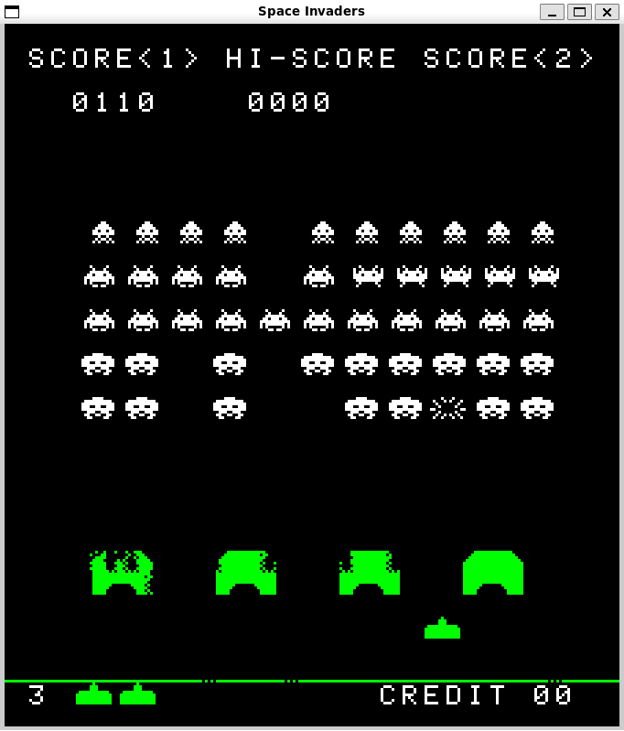

# Space Invaders Emulator
Space Invaders emulator written in C with SDL2.

Personal project to get a first experience in the world of emulation.



## Requirements
To build this program, you need the followings:
- cmake
- SDL2
- SDL2_mixer

## Build
```bash
mkdir build
cd build
cmake ..
```
Then, you can use `make invaders` to build the Space Invaders emulator
or `make cpu-tests` to build the test program for the CPU emulator.

You can also use `make` to build both.

## Run
`./invaders` (The emulator itself)  
`./cpu-tests [0 | 1]` (The CPU tests. 1 for debugging. It is 0 by default)

## Controls
| General commands | Key |
| ------- | --- |
| Insert coin | `C` |
| Start 1P | `Enter` |
| Start 2p | `Numpad 2` or `P` |
| Tilt | `T` |

| Player 1 commands | Key |
| ---- | --- |
| Left | `Q` or `Left arrow` |
| Right | `D` or `Right arrow` |
| Shoot | `Z` or `Up arrow` or `Space` |

| Player 2 commands | Key |
| ---- | --- |
| Left | `K` or `Numpad 4` |
| Right | `M` or `Numpad 6` |
| Shoot | `O` or `Numpad 8` |


## References
To make the Intel 8080 emulator, I used the [8080 Assembly Language Programming Manual](https://altairclone.com/downloads/manuals/8080%20Programmers%20Manual.pdf) and [this opcodes table](https://www.pastraiser.com/cpu/i8080/i8080_opcodes.html).
I also used [superzazu's emulator](https://github.com/superzazu/8080) to help me understand things and to debug.

For the Space Invaders hardware emulation, I used the website [Computer Archeology](https://www.computerarcheology.com/Arcade/SpaceInvaders/) as well as
[kurtjd's emulator](https://github.com/kurtjd/space-invaders-emulator).
